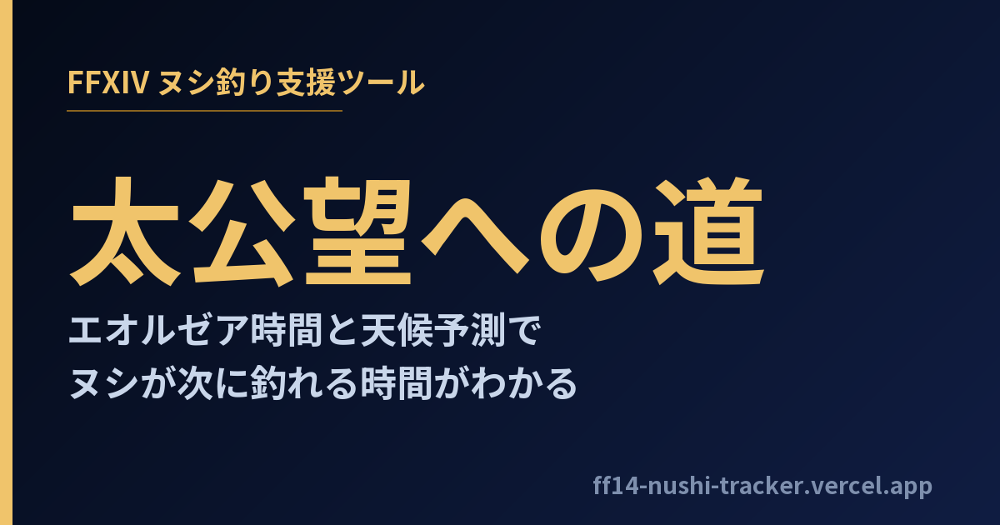

# FFXIV 太公望への道 — ヌシ釣りトラッカー



FINAL FANTASY XIV の**ヌシ**(出現時間・天候が限定された大物)が「次にいつ釣れるか」を、
エオルゼア時間と天候予測から算出してリアルタイムに一覧表示する Web アプリ。
アチーブメント「太公望」シリーズの達成を支援します。

**🎣 公開中: [ff14-nushi-tracker.vercel.app](https://ff14-nushi-tracker.vercel.app)**

---

## 特徴

- **未来の天候を先読み** — FF14 の天候は時刻から決定論的に決まるため、クライアント側だけで何日先でも計算可能。FF14 クライアントの疑似乱数(forecastTarget)をビット演算まで一致させて再現
- **出現が近い順ソート** — 掲載ヌシ 329 種を「次に釣れるまでの残り時間」で並べ替え
- **絞り込み** — 拡張(新生〜黄金)・状態(出現中/時限/常時)・種別(ヌシ/オオヌシ)・フィッシュアイ
- **釣り方の詳細** — 釣り餌・泳がせルート・漁師の直感・アタリ強さ・フィッシュアイ・ルアーリング・マップ座標・最寄りエーテライト
- **餌別逆引き** — 釣り餌ごとに、その餌で釣れるヌシを一覧
- **釣り場ガイド** — 釣り場単位で釣れる魚とオススメ転移先
- **ピン留め & 通知** — 気になるヌシを固定し、出現10分前に Web 通知
- **釣獲記録** — localStorage に自動保存 + エクスポート/インポートで端末移行に対応
- **モバイル最適化** / ダークテーマ / SEO(sitemap・JSON-LD・自作OG画像)

## 技術スタック

| 領域 | 採用技術 |
|---|---|
| フロント | Next.js 14 (App Router) / TypeScript / Tailwind CSS |
| 実行形態 | **完全クライアントサイド計算**・全ページ静的プリレンダリング |
| ホスティング | Vercel (バックエンド API・DB なし) |
| データ生成 | Python (`extract_nushi.py`) |
| 永続化 | localStorage |

サーバーを持たない設計により、ランニングコストゼロ・障害点ゼロ・高速表示(First Load JS 約 90–150KB)を実現。

## アーキテクチャ

```
extract_nushi.py ──(ビルド時)──▶ data/*.json ──▶ Next.js (静的生成) ──▶ Vercel CDN
   ▲                                                    │
   └ ff14-fish-tracker-app / XIVAPI / Teamcraft         └ ブラウザで天候計算・窓探索・localStorage
```

### 主要ロジック

| ファイル | 役割 |
|---|---|
| `lib/eorzeaTime.ts` | リアル⇔エオルゼア時間変換 (ET は 3600/175 ≒ 20.57 倍速) |
| `lib/weather.ts` | 天候予測の決定論ハッシュ再現 + 「次に釣れる窓」探索 |
| `lib/windowInfo.ts` | 窓の状態(出現中/常時/次回)と表示整形 |

「次に釣れる窓」は **時間帯(ET) × 天候 × 直前の天候** の積集合。現在時刻以降の天候窓
(ET8時間 = リアル23分20秒)を走査し、条件を満たす区間を連結して算出します。同じ探索を
「漁師の直感」の予測魚にも再利用しています。

> 実装の詳しい解説はサイト内の [技術解説ページ](https://ff14-nushi-tracker.vercel.app/tech) に掲載。

## データ生成

```bash
# 一次データを取得して JSON を再生成
curl -sL -o fishData.yaml https://raw.githubusercontent.com/icykoneko/ff14-fish-tracker-app/master/private/fishData.yaml
curl -sL -o data_repo.js  https://raw.githubusercontent.com/icykoneko/ff14-fish-tracker-app/master/js/app/data.js
pip install pyyaml
python extract_nushi.py
cp nushi_data.json weather_rates.json spot_fish.json data/
```

全 371 エントリの釣り餌を出典の `bestCatchPath` と 1 件ずつ突き合わせて検証済み。

## 開発

```bash
npm install
npm run dev     # http://localhost:3000
npm run build   # 静的ビルド
```

## データ出典・クレジット

- 魚データ・天候アルゴリズム: [ff14-fish-tracker-app](https://github.com/icykoneko/ff14-fish-tracker-app)
- アイコン・マップ画像・アチーブメント: XIVAPI
- エーテライト(転移先): FFXIV Teamcraft
- 各種DBリンク: The Lodestone

## ライセンス・免責

本リポジトリのソースコードは学習・参考用途に公開しています。ゲーム内の画像・名称等の著作権は
**© SQUARE ENIX CO., LTD.** に帰属します。本サイトはファンによる非公式ツールであり、
スクウェア・エニックスの「著作物利用許諾条件」に従い**非営利**で運営しています
(広告・アフィリエイト等は掲載していません)。
